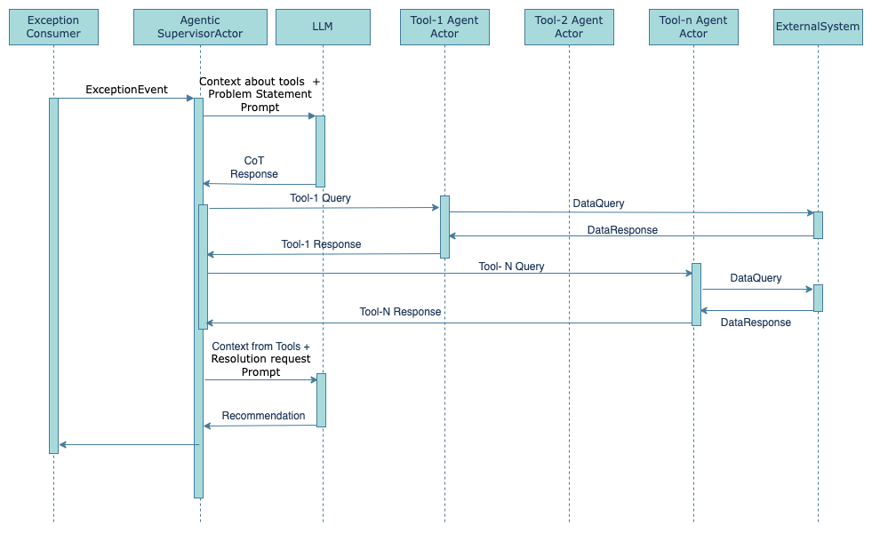
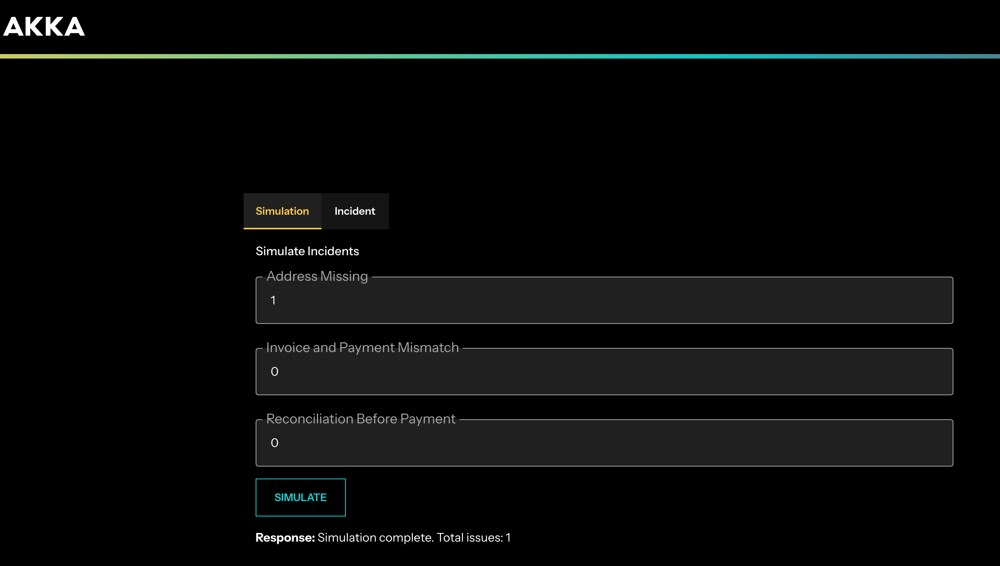
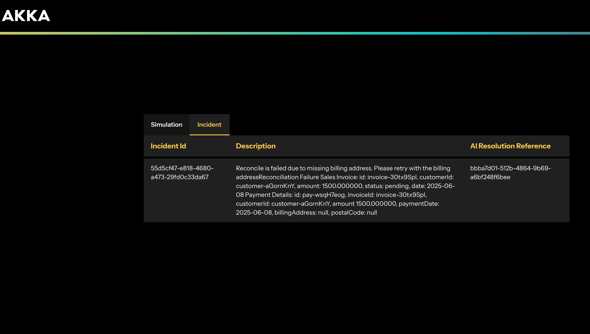
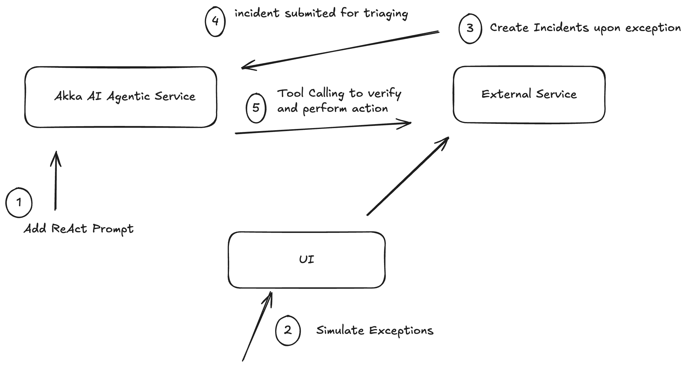

# Order Reconcilliation Agent Sample

## Problem Statement

Order reconciliation in enterprise systems is an essential process to ensure accuracy and consistency in financial records and operational reporting. It involves matching and validating order data across multiple internal and external sources, such as purchase orders, invoices, delivery receipts, and inventory systems. Without effective reconciliation, discrepancies caused by timing mismatches, data entry errors, missing data or missing updates can lead to operational delays, revenue leakage, compliance violations, and weakened trust with customers and suppliers. The primary goal of reconciliation is to detect and correct these discrepancies quickly, ensuring accurate financial reporting, smooth operations, and reliable customer and vendor relationships.

## Solution

This sample implements a ReAct agent using the Akka SDK that streamlines this process by autonomously reasoning through reconciliation logic, invoking relevant data sources and APIs, identifying inconsistencies, and recommending or executing corrective actions. By combining iterative reasoning with tool use, the agent can dynamically adapt to different reconciliation workflows, making it ideal for high-volume, multi-system environments.

### Core Idea of ReAct

Unlike traditional prompting where a model is given a question and returns a single answer, ReAct agents:

- Reason by articulating thoughts (similar to chain-of-thought prompting)
- Act by calling tools, APIs, or interacting with the environment
- Observe the outcome, and repeat the cycle if needed

This makes them ideal for multi-step tasks that require planning, tool use, and adaptation based on intermediate results.

### Augmentation Loop

Below is an overview of the augmentation loop for ReAct agents in this sample:



## Components

This app has three services:

- External Application
- AI Agentic Service
- UI Application

### External Application

This service acts as mock service to mimic sales invoice, payment reconciliation process for customers. This service exposes the following APIs:

```log
@Post
/external/api/sales
/external/api/payments

@Get
/external/api/reconcile/{customerId}
/external/api/incidents
/external/api/sales/{customerId}/{invoiceId}
/external/api/payments/{customerId}/{invoiceId}
/external/api/customers/{customerId}
```

The reconcile API `POST /external/api/reconcile/{customerId}` will trigger the reconciliation process. If the reconcile is failed then it creates the incident in the same service via `POST /external/api/incidents`.

### AI Agentic Service

This service hosts ReAct AI agents, which are triggered by external service incident flow. When a new incident is created at an external service, it submits a request to the AI service, which responds with a reference ID that someone can use to check the status of the flow. The AI service will utilize the tools exposed by the external service to debug the issue and attempt to resolve the problem.

### UI Application

This service is a simple UI application which helps to simulate incident creation by producing reconciliation issues by generating wrong data. The incident tab shows all the incidents that have been created and when an incident is opened, with AI reference id it call AI agentic service to pull the status of ReAct agent for solving this incident.

## Running the Sample

### Prerequisites

- OpenAI API Key
- Java 21 or higher
- Maven 3.6 or higher
- Node.js 21 or higher
- PostMan
- Docker (for deployment)

### Step 1

You will need to obtain an OpenAI Key and set the key as an environment variable as follows:

```shell
# OpenAI Key
export OPENAI_API_KEY="..."
```

### Step 2

Both the `ai-agentic-service` and the `external-service` are built using the Akka SDK and use the same commands for compiling and running the services. Start the Agentic Service first and then the External Service. The Agentic Service runs on port 9000 and the External Service runs on port 9001.

```shell
# use Maven to build the service
mvn clean compile
```

```shell
# start service locally
mvn compile exec:java
```

After you run the above commands for both services you should see something similar to this in the terminal:

```shell
.........
14:35:10.027 INFO  akka.runtime.DiscoveryManager - Service components: EventSourcedEntity: [1], Workflow: [1]
14:35:10.111 INFO  akka.runtime.DiscoveryManager - HTTP endpoint component [com.akka.api.PromptEndpoint], paths: [POST /api/prompts, GET /api/prompts/{promptName}]
14:35:10.111 INFO  akka.runtime.DiscoveryManager - HTTP endpoint component [com.akka.api.ReActAgentEndpoint], paths: [GET /api/react-agent/{agentId}, POST /api/react-agent]
14:35:10.134 INFO  akka.runtime.DiscoveryManager - Akka Runtime started at 127.0.0.1:9000
```
NOTE: for the external service, the port will be 9001.

To understand the Akka concepts that are the basis for this example, see [Development Process](https://doc.akka.io/concepts/development-process.html) in the documentation.

### Step 3

Use PostMan to load the system prompt for the LLM. The name of the API you need to run is `AddPrompt`. This API will send the prompt data to the Agentic service, which will in turn reach out to OpenAI to load the system prompt. This is a crucial step and **MUST** be the first thing you run each time the `ai-agentic-service` is started.

### Step 4

Next, we run the UI with following commands:

```shell
# install dependencies
npm install
```

```shell
# start the UI
npm start
```

### Step 5

In the UI, issue simulation can be orchestrated. The use case is, when an external service encounters an exception which results in incident creation. Afterwich, the incident(s) are reported to the AI service which tries to solve the issue by checking the root cause via API calls (tool calling).

#### The Simulation Screen 

In the simulation screen, we are generating the issue by simulating a missing address. We could also generate other issues like payment mismatch, etc. After selecting the issue, click on the `Simulate` button to create the incident (assuming you numbered one or more simulate incidents).



#### The Incident Screen

To see the incident, click on the `Incidents` tab. Once the incident is created, it will be listed here.


### Orchestrating the Incident

Follow the flow in the image below to see how the incident is resolved:


